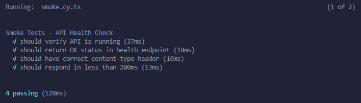
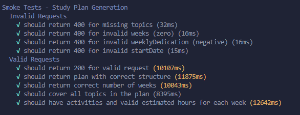
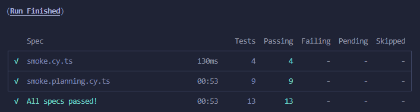

# The Smoke Test

Sistema de generación de planes de estudio utilizando IA para crear planes de estudio personalizados basados en temas, duración y dedicación semanal.

## Prerrequisitos

Antes de ejecutar el sistema, asegúrate de tener instalados:

- **Node.js** (versión 18 o superior)
- **npm** (viene incluido con Node.js)
- Una cuenta en [OpenRouter](https://openrouter.ai/) con una API key válida

## Configuración del Entorno

1. Clona el repositorio:
   ```bash
   git clone https://github.com/Cedricnator/the_smoke_test.git
   cd the_smoke_test
   ```

2. Instala las dependencias:
   ```bash
   npm install
   ```

3. Configura las variables de entorno:
   - Copia el archivo de ejemplo de variables de entorno:
     ```bash
     cp .env.example .env
     ```
   - Edita el archivo `.env` y agrega tu API key de OpenRouter:
     ```
     OPENROUTER_API_KEY=tu_api_key_aqui
     ```

## Ejecutar el Sistema

1. Construye el proyecto:
   ```bash
   npm run build
   ```

2. Inicia el servidor en modo desarrollo:
   ```bash
   npm run dev
   ```

   El servidor se ejecutará en `http://localhost:3000`.

## Ejecutar las Pruebas

### Pruebas de Humo (Smoke Tests)

Las pruebas de humo verifican la disponibilidad básica del sistema y la funcionalidad de la API.

1. Asegúrate de que el servidor esté ejecutándose (ver paso anterior).

2. En una nueva terminal, ejecuta las pruebas de humo:
   ```bash
   npm run smoke:test
   ```

   Esto ejecutará pruebas Cypress que verifican:
   - Disponibilidad de la API (`/health`)
   - Validación de entradas inválidas
   - Generación correcta de planes de estudio
   - Cobertura completa de temas
   - Respetar límites de dedicación semanal


## Pipeline de Respuesta

El sistema sigue un pipeline simple para generar planes de estudio:

1. **Recepción de Solicitud**: La API recibe una solicitud POST en `/api/v1/assistant/study-plan` con los parámetros del plan de estudio.

2. **Validación de Entrada**: Se valida que los datos de entrada cumplan con el esquema requerido (temas, semanas, dedicación semanal, etc.).

3. **Generación con IA**: Se envía una consulta estructurada al modelo de IA a través de OpenRouter, utilizando un prompt detallado que incluye:
   - Instrucciones específicas para crear planes de estudio
   - Ejemplos de few-shot learning
   - Formato de respuesta JSON estricto

4. **Procesamiento de Respuesta**: La respuesta JSON del modelo se valida y se estructura según el esquema definido.

5. **Respuesta al Cliente**: Se devuelve el plan de estudio generado con metadatos (origen LLM, fecha de generación).

### Formato de Entrada

```json
{
  "topics": ["Tema 1", "Tema 2", "Tema 3"],
  "weeks": 4,
  "weeklyDedication": 10,
  "startDate": "2025-11-04", // opcional
  "restrictions": {} // opcional
}
```

### Formato de Salida

```json
{
  "weeks": [
    {
      "weekNumber": 1,
      "startDate": "2025-11-04",
      "endDate": "2025-11-10",
      "topics": ["Tema 1"],
      "activities": ["Actividad 1", "Actividad 2"],
      "estimatedHours": 10,
      "milestone": "Hito opcional"
    }
  ],
  "metadata": {
    "origin": "llm",
    "generatedAt": "2025-11-03T10:00:00.000Z"
  }
}
```

## Arquitectura

- **Backend**: Node.js con Express
- **IA**: OpenRouter (acceso a múltiples modelos)
- **Validación**: Valibot para esquemas de datos
- **Logging**: Pino para registros estructurados
- **Testing**: Cypress para E2E


## Evidencia Resultado

### Pruebas

- Health:




- Plan de studio




- Resultado
  



### Ejemplo

Peticion:

```json
{
  "topics": ["JavaScript", "React", "Node.js"],
  "weeks": 4,
  "weeklyDedication": 10,
  "startDate": "2025-11-15T00:00:00.000Z"
}
```

Respuesta:

```json
{
    "weeks": [
        {
            "weekNumber": 1,
            "startDate": "2025-11-15",
            "endDate": "2025-11-21",
            "topics": [
                "JavaScript"
            ],
            "activities": [
                "Estudiar fundamentos de JavaScript: variables, tipos de datos y operadores",
                "Practicar funciones y estructuras de control (if/else, bucles)",
                "Trabajar con arrays y objetos",
                "Resolver ejercicios de programación básicos"
            ],
            "estimatedHours": 10
        },
        {
            "weekNumber": 2,
            "startDate": "2025-11-22",
            "endDate": "2025-11-28",
            "topics": [
                "React"
            ],
            "activities": [
                "Introducción a React: componentes y JSX",
                "Crear componentes funcionales y de clase",
                "Trabajar con props y estado",
                "Implementar eventos y manejo de formularios"
            ],
            "estimatedHours": 10
        },
        {
            "weekNumber": 3,
            "startDate": "2025-11-29",
            "endDate": "2025-12-05",
            "topics": [
                "React"
            ],
            "activities": [
                "Profundizar en Hooks (useState, useEffect)",
                "Crear una aplicación pequeña con React",
                "Implementar routing básico",
                "Practicar manejo de estado global con Context API"
            ],
            "estimatedHours": 10
        },
        {
            "weekNumber": 4,
            "startDate": "2025-12-06",
            "endDate": "2025-12-12",
            "topics": [
                "Node.js"
            ],
            "activities": [
                "Introducción a Node.js y entorno de ejecución",
                "Crear servidor HTTP básico",
                "Trabajar con módulos y NPM",
                "Conectar React frontend con Node.js backend"
            ],
            "estimatedHours": 10
        }
    ],
    "metadata": {
        "origin": "tngtech/deepseek-r1t-chimera:free",
        "generatedAt": "2025-11-02T22:00:00.000Z"
    }
}
```